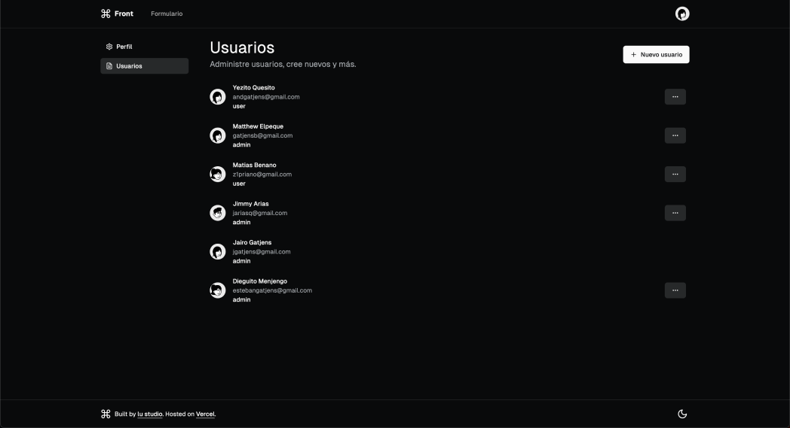
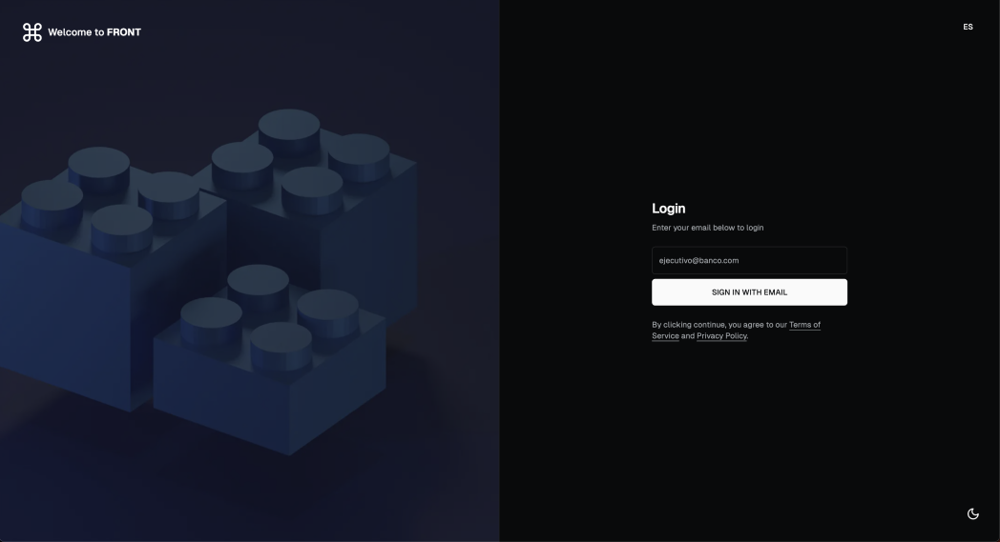
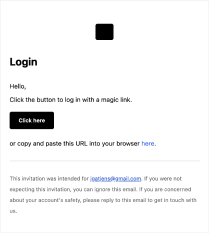

# Template FrontApp

- [Next.js](https://nextjs.org)
- [NextAuth.js](https://next-auth.js.org)
- [Drizzle](https://orm.drizzle.team/)
- [shadcn](https://ui.shadcn.com/)
- [tRPC](https://trpc.io)
- [Postgres](https://tailwindcss.com)
- [lucide react](https://lucide.dev/guide/packages/lucide-react)

## Features

- Example login form
- Login with email (using google personal account)
- TRPC react server components
- Example how to handle CRUD (admin users)

| Users Admin                | Login                            |
| -------------------------- | -------------------------------- |
|  |  |

## shadcn add components

```bash
#example
npx shadcn-ui@latest add button
```

## Docker (db and pgadmin)

```bash
# creates docket containers
docker-compose up --build -d

# if you use pgadmin from docker the Host name/Adress would be the postgres container_name:
# example: frontapp_postgres

# add tables to db and generates prisma client
npm run db:push

# Create a dump backup
# -U username
# -d database
# -h hostname
# --data-only only data
pg_dump -h {POSTGRES_HOST} -U {POSTGRES_USER} -d {POSTGRES_DB} --data-only > ./db/dev_backup.dump

# clear database data
docker exec -i frontapp_postgres psql -U postgres -d frontapp < ./db/dev_clear_data.sql

# restore database on local docker
docker exec -i frontapp_postgres psql -U postgres -d frontapp < ./db/dev_backup.dump
```

## React Template

[Frontapp Email Repo](https://github.com/jgatjens/frontapp.email)


